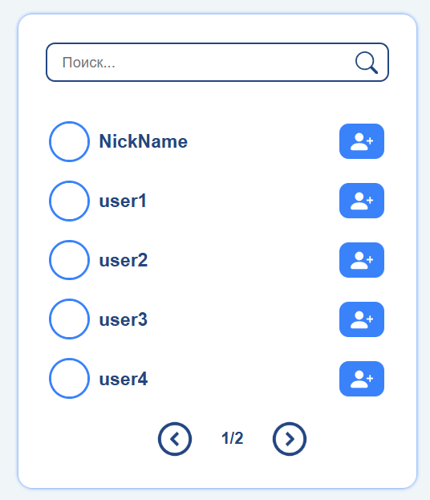
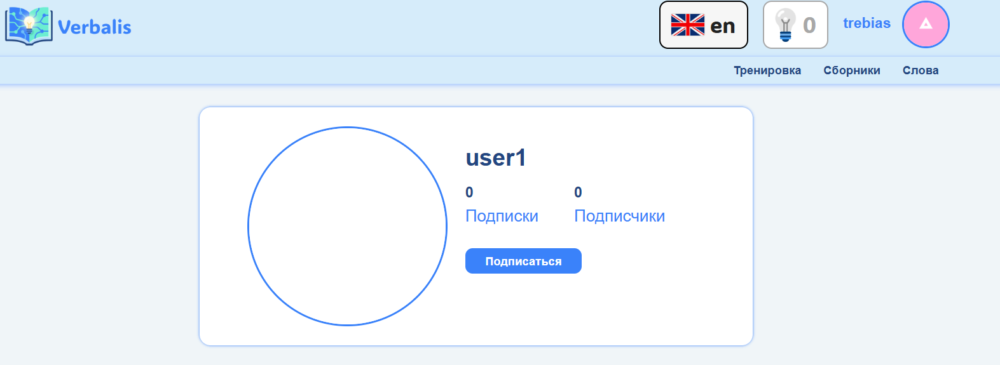
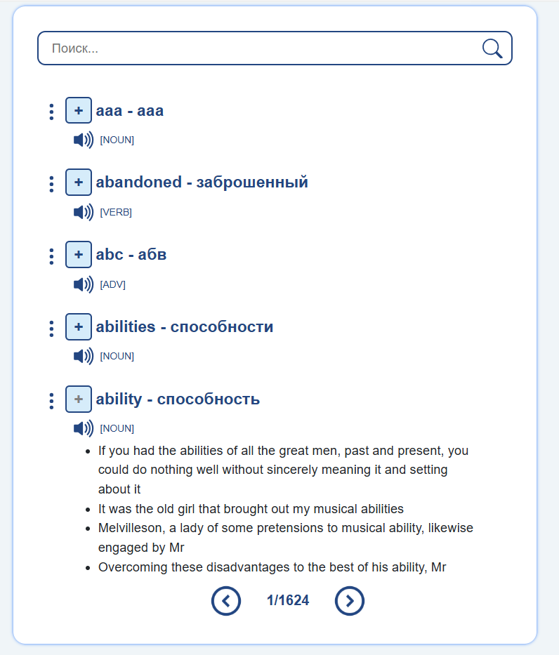
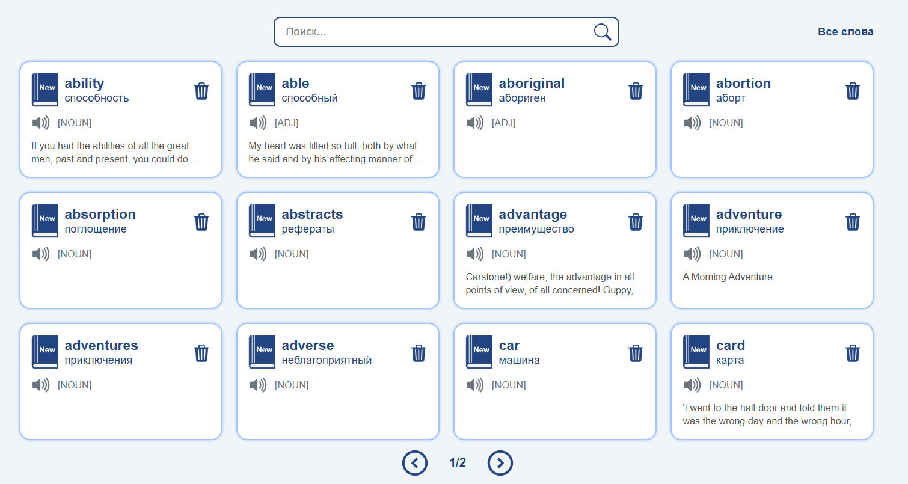

# Приложение для изучения иностранных слов

Был взят свой варинат. Описание: в приложении есть несколько языков для изучения, которые задает администратор, пользователь может выбрать любой из имеющихся самостоятельно. Для каждого языка есть список слов (характеризуется словом на иностранном языке, переводом на русский, частью речи), к кажому слову может быть некоторое количество примеров предложений. Пользователь может добавлять и удалять слова из общего списка слов в свой список. Слова в теории можно будет изучать для этого есть модули тренировки, которые задает администратор, пользователь может включать или выключать определнные модули. Пользователи могут подписываться друг на друга.

Что было сделано в общих чертах: настроена модель пользователя и все нужные для работы с пользователем страницы, реализованы таблицы со схемы ниже, присутствуют связи как один ко многим, так и многие ко многим. Написаны страницы для отображения информации об одном объекте (DetailView), страницы для отображения списков объектов (ListView), на таких страницах настроена пагинация и поиск. Настроена работа с изображениями, написаны кастромные формы, где необходимо. Сверстаны страницы без использования повторяющегося кода.

## Схема базы данных:

## Ход работы

### Пользователь
Были настроены страницы для регистрации, входа и все остальные для работы с пользователями, смена пароля, изменнеие информации, выход, просмотр профиля, страницы успеха (смены пароля, выхода), была переопределена модель пользователя для хранения выбранного языка изучения и фото профиля. 

#### Примеры страниц
Страница регистрации:

Карточка пользоватля:

Также была написана страница для отображения списка пользователей, добвалена возможность подписываться и отписываться от других пользователй

#### Примеры страниц

Список пользователей:

Карточка другого пользователя:

### Слова

Были настроены страницы для просмотра списка слов из всей базы, списка добавленных слов пользователя, возможность добавления и удаления слов из словаря пользователя. У слов может как не быть ни одного примера предложения, так и быть несоклько.

#### Примеры страниц

Список слов общий:

Список слов пользователя:

