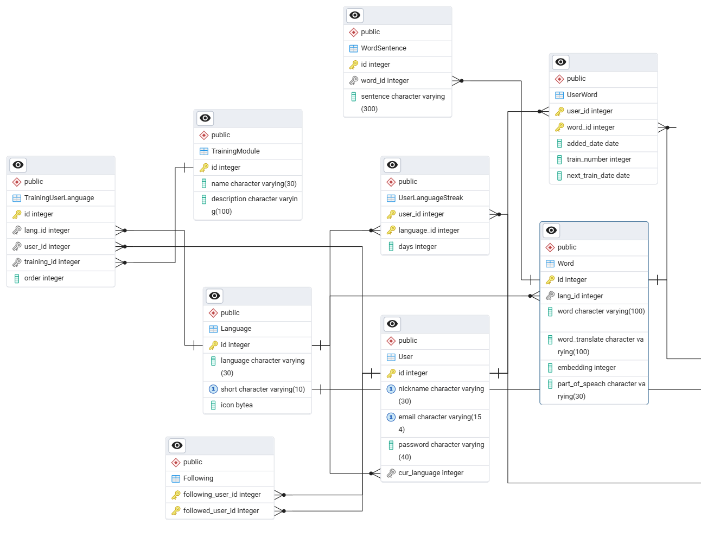
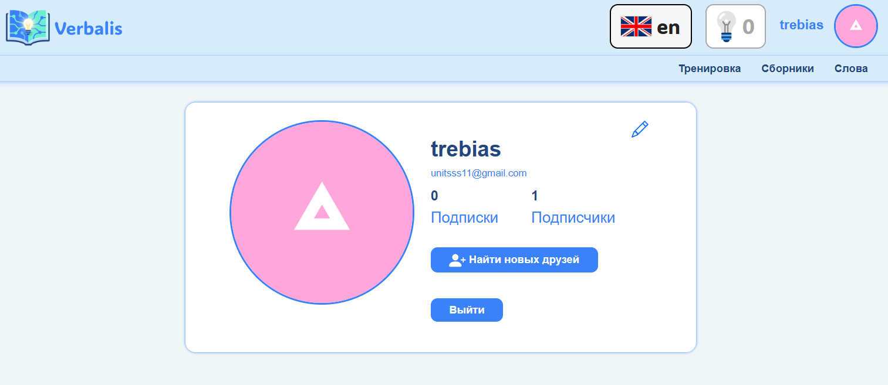

# Приложение для изучения иностранных слов

Был взят свой варинат. Описание: в приложении есть несколько языков для изучения, которые задает администратор, пользователь может выбрать любой из имеющихся самостоятельно. Для каждого языка есть список слов (характеризуется словом на иностранном языке, переводом на русский, частью речи), к кажому слову может быть некоторое количество примеров предложений. Пользователь может добавлять и удалять слова из общего списка слов в свой список. Слова в теории можно будет изучать для этого есть модули тренировки, которые задает администратор, пользователь может включать или выключать определнные модули. Пользователи могут подписываться друг на друга.

## Схема базы данных:

## Ход работы

### Пользователь
Были настроены страницы для регистрации, входа и все остальные для работы с пользователями, смена пароля, изменнеие информации, выход, просмотр профиля, страницы успеха (смены пароля, выхода), была переопределена модель пользователя для хранения выбранного языка изучения и фото профиля. 

### Примеры страниц
Страница регистрации:

Карточка пользоватля:

Также была написана страница для отображения списка пользователей, добвалена возможность подписываться и отписываться от других пользователй

### Примеры страниц

